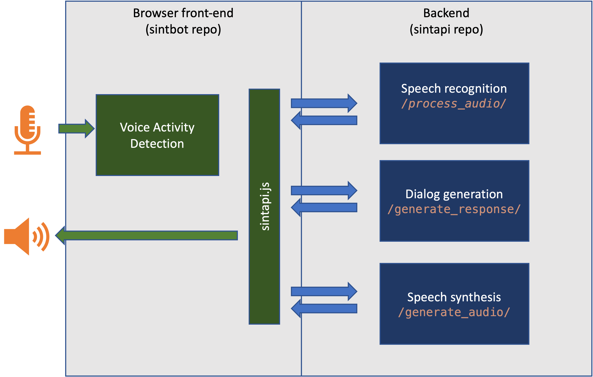

## SintAPI
This is a basic API (FastAPI) for a conversational agent that does:
1. Speech recognition (GCP speech recognition or Whisper via Replicate.ai)
2. Dialog generation (GPT-3 via OpenAI)
3. Speech synthesis (GCP speech synthesis)

## Run it
Make sure you have the frontend running too (https://github.com/vspruyt/sintbot)!
```bash
> uvicorn main:app --reload --port 9999
```




Make sure to set the following environment variables:
```bash
export OPENAI_API_KEY="yourkey"
export GOOGLE_APPLICATION_CREDENTIALS="yourpath_to_credtials.json"
# export REPLICATE_API_TOKEN="yourkey"
```